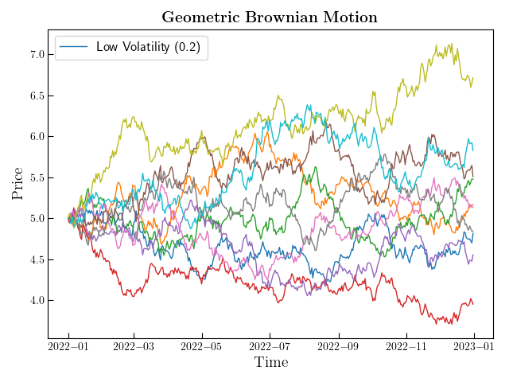
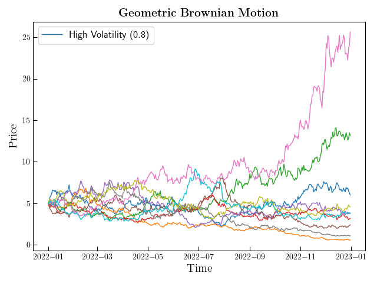
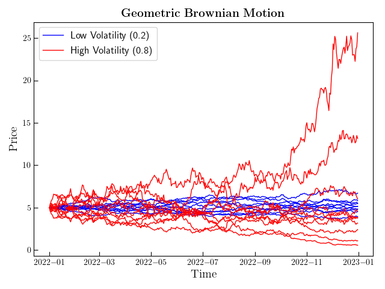

# Geometric Brownian Motion
In this project we take a look at how the Brownian Motion can be used to
model the pricing of finantial instruments. In particular, we model index 
pricing using a Black-Scholes-Merton setup with constant volatility. 
The future index level can be described by the following random variable:
$$S_T = S_0 \exp{\left[ T(r-\frac{1}{2}\sigma^2) + \sigma \sqrt{T} z\right]}$$
which defines the index label at time $T$, $S_T$, as a function of the constant riskless short rate $r$ and the constant volatility $\sigma$. The variable $z$ is normally distributed.  
Some results are shown in the following Figures, for both low and high volatility values, as wells as a comparison between the two set of paths to better appreciate their differences in scale:

